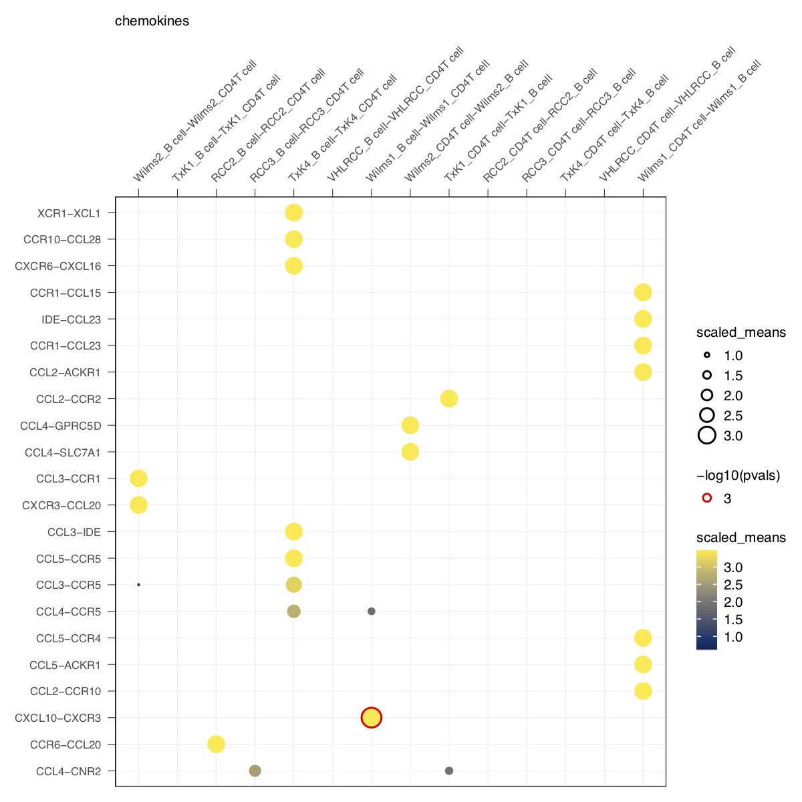
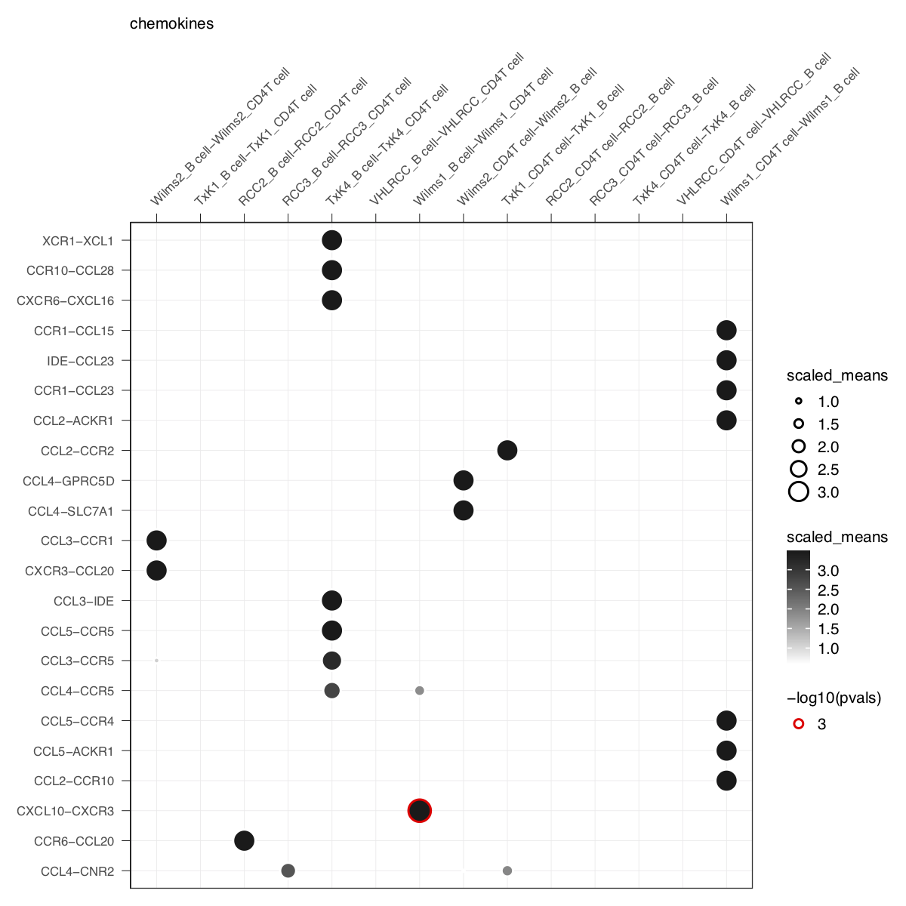
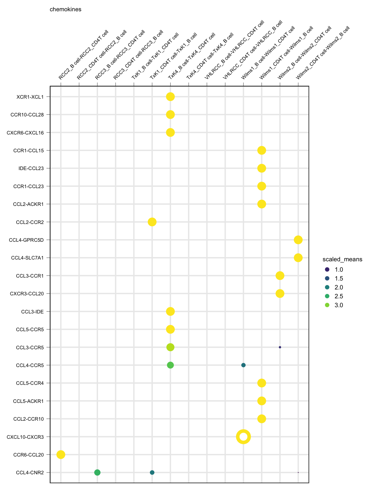
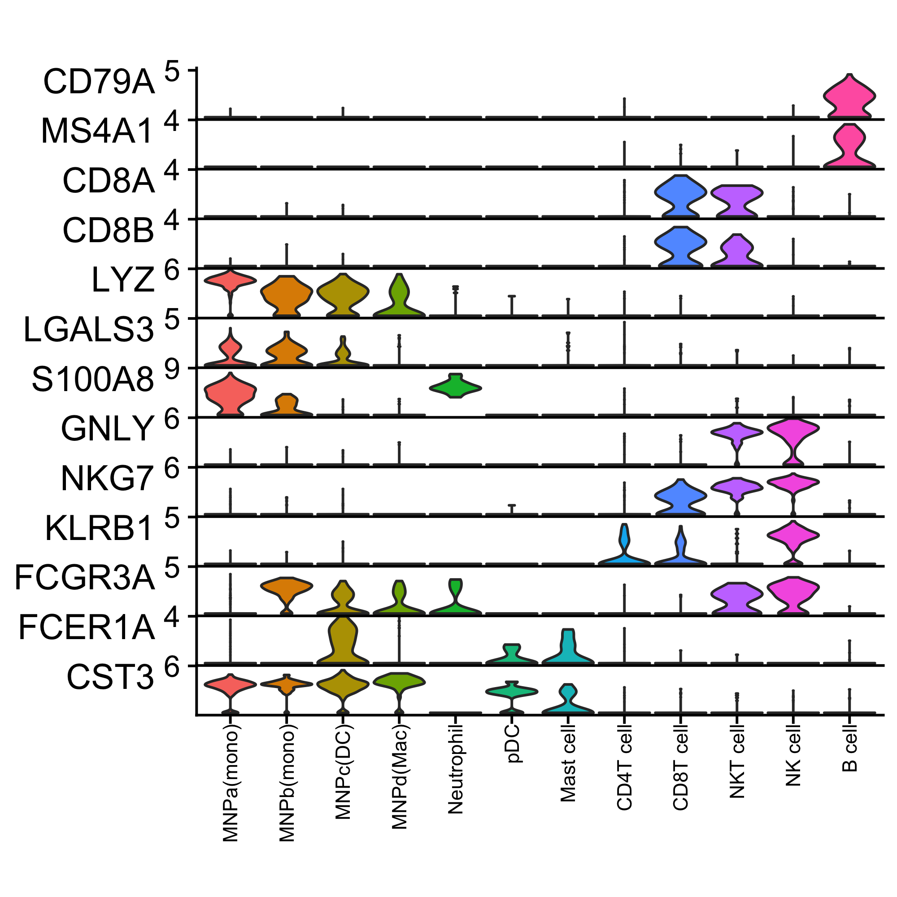
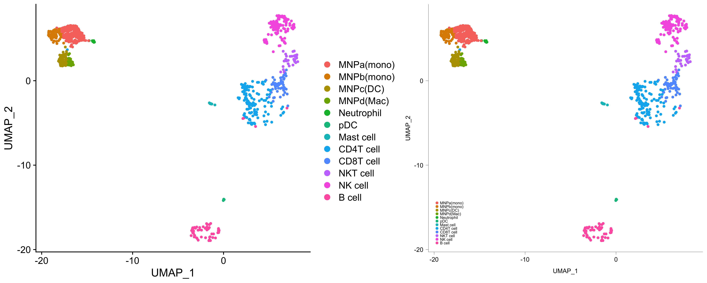

[](https://opensource.org/licenses/MIT)
[](https://codecov.io/gh/zktuong/ktplots)
[](https://travis-ci.com/zktuong/ktplots)

# ktplots
R plotting functions to plot gene expression data of single-cell data.


## Installation instructions
You can install the package via ```devtools::install_github()``` function in R
```R
if (!requireNamespace("devtools", quietly = TRUE))
    install.packages("devtools")
if (!requireNamespace("BiocManager", quietly = TRUE))
    install.packages("BiocManager")
devtools::install_github('zktuong/ktplots', dependencies = TRUE)
```
## Usage instructions
```R
library(ktplots)
```
There is a test dataset in Seurat format to test the functions.
```R
# note, you need to load Seurat to interact with it
# so maybe install Seurat if you haven't already
# if (!requireNamespace("Seurat", quietly = TRUE))
    # install.packages("Seurat")
library(Seurat)
data(kidneyimmune)
```
The data is downsampled from the [kidney cell atlas](https://kidneycellatlas.org). 

For more info, please see [Stewart et al. kidney single cell data set published in Science 2019](https://science.sciencemag.org/content/365/6460/1461).

### geneDotPlot
Plotting gene expression dot plots heatmaps.
```R
# Note, this conflicts with tidyr devel version
geneDotPlot(scdata = kidneyimmune, # object 
	genes = c("CD68", "CD80", "CD86", "CD74", "CD2", "CD5"), # genes to plot
	idents = "celltype", # column name in meta data that holds the cell-cluster ID/assignment
	split.by = 'Project', # column name in the meta data that you want to split the plotting by. If not provided, it will just plot according to idents
	standard_scale = TRUE) + # whether to scale expression values from 0 to 1. See ?geneDotPlot for other options
theme(strip.text.x = element_text(angle=0, hjust = 0, size =7)) + small_guide() + small_legend()
```
Hopefully you end up with something like this:


### plot_cpdb
Generates a dot plot after CellPhoneDB analysis via specifying the query celltypes and genes. 

The plotting is largely determined by the format of the meta file provided to CellPhoneDB analysis. 

For the ```split.by``` option to work, the annotation in the meta file must be defined in the following format:
```R
{split.by}_{idents}
```

so to set up an example vector, it would be something like:
```R
annotation <- paste0(kidneyimmune$Experiment, '_', kidneyimmune$celltype)
```

To run, you will need to load in the means.txt and pvals.txt from the analysis.
```R
# pvals <- read.delim("pvalues.txt", check.names = FALSE)
# means <- read.delim("means.txt", check.names = FALSE)

# I've provided an example dataset
data(cpdb_output) 
plot_cpdb(cell_type1 = 'B cell', cell_type2 = 'CD4T cell', scdata = kidneyimmune,
	idents = 'celltype', # column name where the cell ids are located in the metadata
	split.by = 'Experiment', # column name where the grouping column is. Optional.
	means = means, pvals = pvals,
	genes = c("XCR1", "CXCL10", "CCL5")) + 
small_axis(fontsize = 3) + small_grid() + small_guide() + small_legend(fontsize = 2) # some helper functions included in ktplots to help with the plotting
```


You can also try specifying ```gene.family``` option which will grep some pre-determined genes.
```R
plot_cpdb(cell_type1 = 'B cell', cell_type2 = 'CD4T cell', scdata = kidneyimmune,
	idents = 'celltype', means = means, pvals = pvals, split.by = 'Experiment',
	gene.family = 'chemokines') + small_guide() + small_axis() + small_legend(keysize=.5)
```

```R
plot_cpdb(cell_type1 = 'B cell', cell_type2 = 'CD4T cell', scdata = kidneyimmune,
	idents = 'celltype', means = means, pvals = pvals, split.by = 'Experiment',
	gene.family = 'chemokines', col_option = "maroon", highlight = "blue") + small_guide() + small_axis() + small_legend(keysize=.5)
```

```R
plot_cpdb(cell_type1 = 'B cell', cell_type2 = 'CD4T cell', scdata = kidneyimmune,
	idents = 'celltype', means = means, pvals = pvals, split.by = 'Experiment',
	gene.family = 'chemokines', col_option = viridis::cividis(50)) + small_guide() + small_axis() + small_legend(keysize=.5)
```

```R
plot_cpdb(cell_type1 = 'B cell', cell_type2 = 'CD4T cell', scdata = kidneyimmune,
	idents = 'celltype', means = means, pvals = pvals, split.by = 'Experiment',
	gene.family = 'chemokines', noir = TRUE) + small_guide() + small_axis() + small_legend(keysize=.5)
```


A new style to plot inspired from `squidpy.pl.ligrec` where significant interactions are shown as outline instead.
```R
plot_cpdb(cell_type1 = 'B cell', cell_type2 = 'CD4T cell', scdata = kidneyimmune,
	idents = 'celltype', means = means, pvals = pvals, split.by = 'Experiment',
	gene.family = 'chemokines', default_style = FALSE) + small_guide() + small_axis() + small_legend(keysize=.5)
```


if ```genes``` and ```gene.family``` are both not specified, the function will try to plot everything.

Specifying ```keep_significant_only``` will only keep those that are p<0.05 (which you can try to adjust with ```p.adjust.method```).

### StackedVlnPlot
Generates a stacked violinplot like in scanpy's ```sc.pl.stacked_violin```. 

Credits to [@tangming2005](https://twitter.com/tangming2005). 
```R
features <- c("CD79A", "MS4A1", "CD8A", "CD8B", "LYZ", "LGALS3", "S100A8", "GNLY", "NKG7", "KLRB1", "FCGR3A", "FCER1A", "CST3")
StackedVlnPlot(kidneyimmune, features = features) + theme(axis.text.x = element_text(angle = 90, hjust = 1, size = 8))
```

Seems like standard ggplot ```theme``` functions only work on the x-axis. Need to work out how to adjust that.

### rainCloudPlot
Generates a raincloudplot to use boxplot, scatterplot and violin all at once!

Adopted from [https://wellcomeopenresearch.org/articles/4-63](https://wellcomeopenresearch.org/articles/4-63)
```R
rainCloudPlot(data = kidneyimmune@meta.data, groupby = "celltype", parameter = "n_counts") + coord_flip()
```


### small_legend/small_guide/small_axis/small_grid/topright_legend/topleft_legend/bottomleft_legend/bottomright_legend
As shown in the examples above, these are some functions to quickly adjust the size and position of ggplots.
```R
# for example
g <- Seurat::DimPlot(kidneyimmune, color = "celltype")
g1 <- g + small_legend() + small_guide() + small_axis() + bottomleft_legend() 
library(patchwork)
g + g1
```

